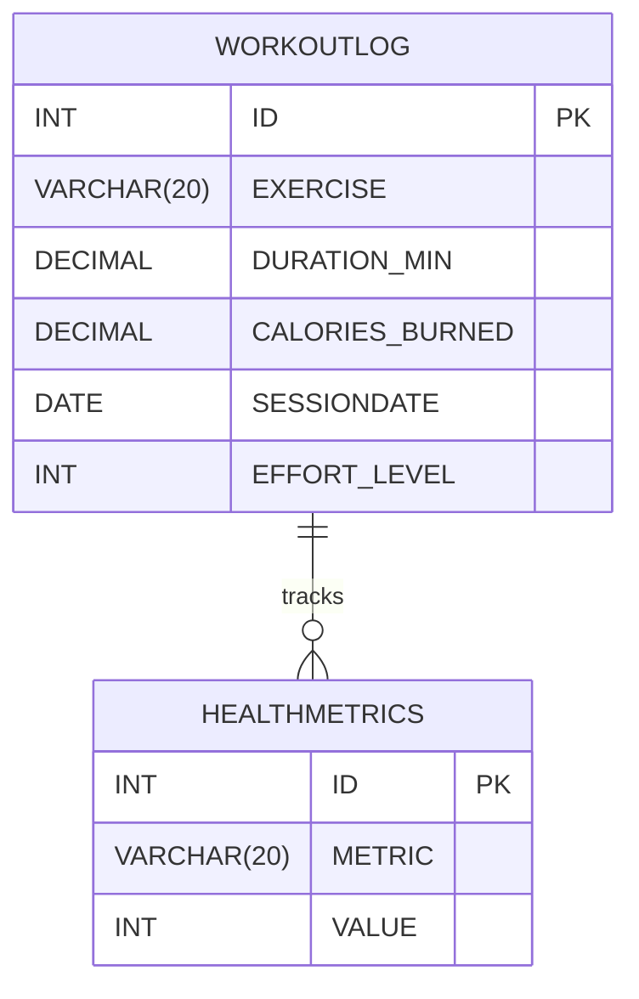

# sql_challenge_data_analysis_project

### Here is the table scema

```mermaid
erDiagram
    WORKOUTLOG {
        INT ID PK
        VARCHAR(20) EXERCISE
        DECIMAL DURATION_MIN
        DECIMAL CALORIES_BURNED
        DATE SESSIONDATE
        INT EFFORT_LEVEL
    }

    HEALTHMETRICS {
        INT ID PK
        VARCHAR(20) METRIC
        INT VALUE
    }

    WORKOUTLOG ||--o{ HEALTHMETRICS : "tracks"
```
