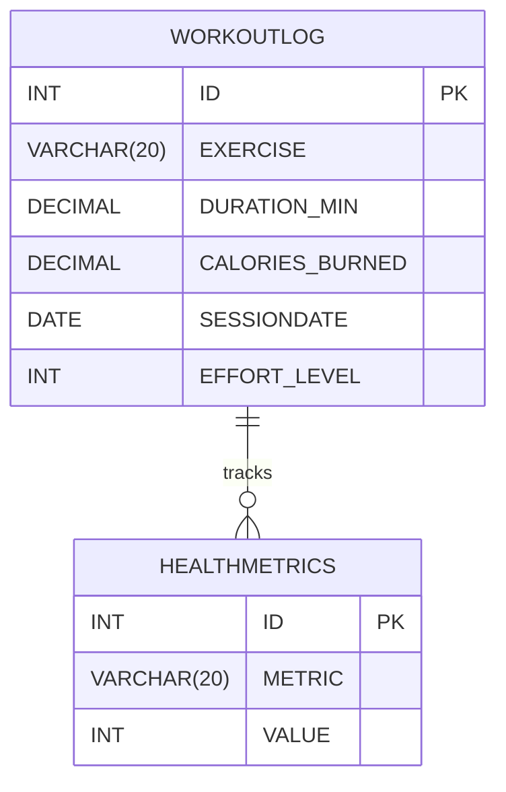

# sql_design_query_RDM_analysis_project

### Objective
Design and query relational databases to practice SQL fundamentals and demonstrate data analysis skills.

### Features

Create Tables  --> Define structured schemas with primary keys and constraints.

Insert Records --> Populate tables with sample datasets (pets, exercise/health).

Update Data  --> Modify records (e.g., add Quantity or Effort_Level to track changes).

Alter Tables  --> Rename columns and extend schema to reflect new requirements.

Analyze Data  --> Query tables to explore sales, workouts, or health metrics for insights.

Schema Visualization  --> Mermaid ER diagrams included for clear data structure mapping.

